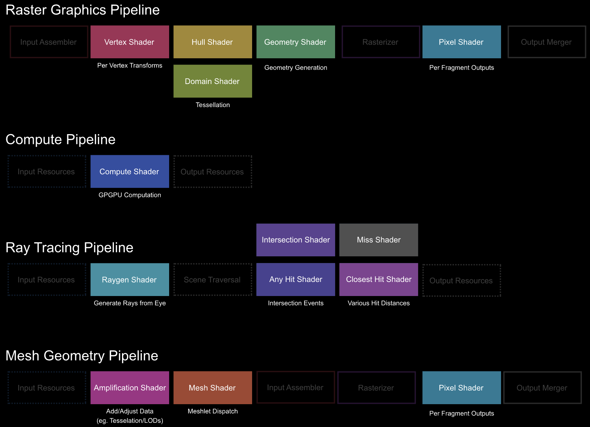
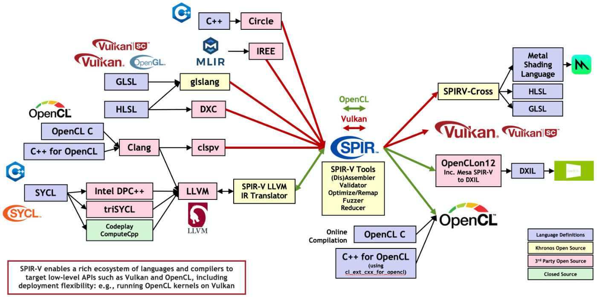

# Easy Shading Language设计报告

> ***ZY2206120 韩程凯***
>
> ***ZY2206336 石锦川***

[TOC]

# 1 背景介绍

根据计算效率和用途，着色器分为离线渲染着色器和实时渲染着色器。

离线渲染着色器是在离线渲染中使用的着色器，其可以实现尽可能高的图像质量。实现该类着色器时，不需要什么编程技巧和硬件知识，其中材料属性是完全抽象的概念。这类着色器通常由艺术家开发，从而获得正确合适的 "效果"。由于离线渲染的目的是产生足够逼真且精细的结果，离线渲染着色器需要进行大量的计算，所以处理历险着色器是非常耗时的，同时需要大量的计算资源。大多数情况下，离线渲染需要使用大型计算机集群进行计算。典型的离线渲染着色器语言有RenderMan Shading Language（RSL），Houdini VEX Shading Language（VEX），Gelato Shading Language，Open Shading Language（OSL）等等。

实时渲染着色器是用于实时渲染的着色器，由于显卡等硬件的发展，该类着色器当前应用非常广泛。它们提供了更高级的硬件抽象和更灵活的编程模型，而不是以前的硬编码转换和着色器方程的范式。这使得程序员能够更好地控制着色器内部的计算过程和呈现方式，并以较低的开销实现更丰富的内容。该类着色器是本项目关注的重点。

实时渲染着色器是一组程序指令，它们在给定的可编程GPU流水线的特定步骤中执行，可以是光栅化流水线、通用计算、光线追踪等。



现阶段的着色器可以用来转换顶点、在基于光栅的渲染中给像素着色、在射线追踪中处理复杂的计算、训练机器学习模型、执行通用计算等等。着色器在单指令多数据（SIMD）体系结构上执行。在这种体系结构中，计算单元在大量的数据上执行相同的指令。不同的硬件供应商，设计了不同的单指令多数据体系结构。例如，在AMD硬件上，一个内核执行32或64个调度线程，这些线程被称为波阵面或线程组。这些线程在一个小型处理器上执行时，该处理器处理存储在组的本地缓存或GPU内存中的标量、向量数据。

实时渲染着色器的发展历程中，涌现出一批优秀且富有特色的着色器语言，但是仅有少数得以延续和发展，并广为使用。下表为现阶段常见的实时渲染着色器语言、其对应的图形API和其可实现的Transpiling。

| 缩写 | 着色器语言                  | 官方图形API     | Transpiling                             |
| ---- | --------------------------- | --------------- | --------------------------------------- |
| HLSL | High Level Shading Language | DirectX         | `dxc` 与 `glslang` 均支持 HLSL → SPIR-V |
| GLSL | OpenGL Shading Language     | Vulkan / OpenGL | GLSL → SPIR-V → HLSL                    |
| MSL  | Metal Shading Language      | Metal           | SPIR-V Cross 支持 SPIR-V → MSL          |
| WGSL | WebGPU Shading Language     | WebGPU          | `naga` 或 `tint` → SPIR-V               |

除以上的着色器语言之外，还有一些平台特定的语言，例如索尼的PlayStation Shading Language （PSL）、应用于早期Unity 3D的C for Graphics （Cg）等等。使用哪一种语言取决于的应用的目标平台和API。

由于有太多的供应商和API，各类着色器语言在设计上是分散的，但每一种着色语言都与C语言非常相似，使用者可以很容易地在它们之间切换。根据语言的不同，着色器语言可能有一个API特定的中介表示（IR），每个硬件供应商（AMD、NVIDIA、Intel、Qualcomm等）在驱动程序级别上将该IR转换为他们自己的机器代码。现阶段常见的IR如下表所示。

| IR缩写    | 描述                                          | 官方图形API     |
| --------- | --------------------------------------------- | --------------- |
| DXIL      | DirectX Intermediate Language                 | DirectX 12      |
| DXBC      | DirectX Bytecode                              | DirectX 11 / 12 |
| SPIR-V    | Standard Portable Intermediate Representation | Vulkan / OpenGL |
| RDNA2 ISA | AMD 6000 Series Instruction Set Architecture  | N/A             |
| PTX       | NVIDIA Parallel Thread Execution              | N/A             |

本项目采用SPRI-V作为IR，因为其存在完整易用的工具链、优质的文档和活跃的社区。

SPIR-V正在催化用于表达并行计算和基于GPU的图形的着色器和内核语言编译器的生态系统中的一场革命。SPIR-V使高级语言前端能够以标准化的中间形式发出程序，以便被Vulkan、OpenGL或OpenCL驱动程序所吸收。SPIR-V消除了设备驱动程序中对高级语言前端编译器的需求，大大降低了驱动程序的复杂性，使广泛的语言和框架前端能够在不同的硬件架构上运行，并鼓励一个充满活力的开源分析、移植、调试和优化工具的生态系统。对于开发者来说，使用SPIR-V意味着内核源代码不再需要直接开源，内核加载时间可以加快，而且开发者可以选择使用通用的语言前端编译器，提高内核的可靠性和跨多个硬件实现的可移植性。下图可以展示SPRI-V在着色器世界中的充当的角色和发挥的功能。



SPRI-V项目使得着色器世界中的各类语言可以实现相互转化、交叉编译等等，同时将着色器编译的前后端解耦，有助于构建更加灵活方便的开发环境。

# 2 设计驱动

我们希望设计一门简单、易上手的实时渲染着色器语言ESL（Easy shading language）。首先，该语言的语法参考类C语法，简单易学，只需有入门基础的程序员都可以轻松上手该语言。其次，通过这种简单的语言，程序员可以实现丰富多样的静态和动态图像效果。

该语言相比于现有的着色器语言进行了大量的简化，降低了着色器语言的学习门槛，程序员通过简单的图形学知识实现复杂的图像效果，也可以提高学习人员对于图形学的积极性。

# 3 词法设计

本章将介绍本语言的词法定义，本语言对于大小写不敏感。

## 3.1 关键字

| 关键字 | 类型码   |
| ------ | -------- |
| void   | VOIDTK   |
| int    | INTTK    |
| float  | FLTTK    |
| array  | ARRTK    |
| main   | MAINTK   |
| if     | IFTK     |
| else   | ELSETK   |
| while  | WHILETK  |
| return | RETURNTK |
| break  | BRKTK    |
| in     | INTK     |
| out    | OUTTK    |

## 3.2 运算符

### 3.2.1 算术运算符

| 运算符 | 类型码 |
| ------ | ------ |
| +      | PLUS   |
| -      | MINU   |
| *      | MULT   |
| /      | DIV    |

### 3.2.2 关系运算符

| 关系运算符 | 类型码 |
| ---------- | ------ |
| <          | LSS    |
| <=         | LEQ    |
| >          | GRE    |
| >=         | GEQ    |
| ==         | EQL    |
| !=         | NEQ    |

### 3.2.3 逻辑运算符

| 逻辑运算符 | 类型码 |
| ---------- | ------ |
| &&         | ANDTK  |
| \|\|       | ORTK   |

### 3.2.4 辅助运算符

| 辅助运算符 | 类型码  |
| ---------- | ------- |
| =          | ASSIGN  |
| ;          | SEMICN  |
| ,          | COMMA   |
| (          | LPARENT |
| )          | RPARENT |
| [          | LBRACK  |
| ]          | RBRACK  |
| {          | LBRACE  |
| }          | RBRACE  |

## 3.3 标识符与常量

| 标识符与常量 | 类型码 |
| ------------ | ------ |
| 标识符       | IDENFR |
| 无符号整数   | INTCON |
| 无符号小数   | FLTCON |

# 4 语法设计

本章介绍本语言的完整语法设计。

## 4.1 类型标识符

```
<类型标识符> ::= int | float | array'['<无符号整数>']' | array'['<无符号整数>']''['<无符号整数>']'

<字母> ::= _ | a | ... | z | A | ... | Z

<数字> ::= 0 | 1 | ... | 9

<无符号整数> ::= <数字>{<数字>}

<整数> ::= [+|-]<无符号整数>

<小数> ::= [+|-]<无符号小数>

<无符号小数> ::= <无符号整数>'.'<无符号整数>

<加法运算符> ::= + | -

<乘法运算符> ::= * | /

<关系运算符> ::= < | <= | > | >= | != | ==

<标识符> ::= <字母>{<字母>|<数字>}
```

## 4.2 表达式

```
<表达式> ::= [+|-]<项>{<加法运算符><项>}

<项> ::= <因子>{<乘法运算符><因子>}

<因子> ::= <标识符> | <标识符>'['<表达式>']' | <标识符>'['<表达式']''['<表达式']' | '('<表达式>')' | <整数> | <小数> | <有返回值函数调用语句>
```

## 4.3 变量定义

```
<常量> ::= <整数> | <小数>

<输入输出说明> ::= <输入输出定义>; {<输入输出定义>;}

<输入输出定义> ::= in <类型标识符> <标识符> | out <类型标识符> <标识符>

<变量说明> ::= <变量定义>; {<变量定义>;}

<变量定义> ::= <变量定义无初始化> | <变量定义及初始化>

<变量定义无初始化> ::= <类型标识符> <标识符>{, <标识符>}

<变量定义及初始化> ::= <类型标识符> <标识符> = <常量> | <类型标识符> <标识符> = '{' <常量> {, <常量>} '}' | <类型标识符> <标识符> = '{''{'<常量>{, <常量>}'}'{, '{'<常量>{, <常量>}'}'}'}'
```

## 4.4 语句

```
<语句> ::= <循环语句> | <条件语句> | <赋值语句>; | <有返回值函数调用语句>; | <无返回值函数调用语句>; | <空>; | <返回语句>; | '{'<语句列>'}' | break;

<逻辑运算符> ::= && | ||

<条件> ::= <条件项>{<逻辑运算符><条件项>}

<条件项> ::= <表示式><关系运算符><表达式> | '('<条件>')'

<循环语句> ::= while '('<条件>')' <语句>

<条件语句> ::= if  '('<条件>')' <语句> [else <语句>]

<赋值语句> ::= <标识符> = <表达式> | <标识符> = '{'<表达式>{, <表达式>}'}' | <标识符> = '{''{'<表达式>{, <表达式>}'}'{, '{'<表达式>{, <表达式>}'}'}'}' | <标识符>'['<表达式>']' = <表达式> | <标识符>'['<表达式>']''['<表达式>']' = <表达式> 

<值参数表> ::= <表达式>{, <表达式>} | <空>

<有返回值函数调用语句> ::= <标识符>'('<值参数表>')'

<无返回值函数调用语句> ::= <标识符>'('<值参数表>')'

<返回语句> ::= return [<表达式>]
```

## 4.5 函数与程序

```
<声明头部> ::= <类型标识符> <标识符>

<参数表> ::= <类型标识符> <标识符>{, <类型标识符> <标识符>} | <空>

<复合语句> ::=[<变量说明>] <语句列>

<有返回值函数定义> ::= <声明头部>'('<参数表>')''{'<复合语句>'}'

<无返回值函数定义> ::= void <标识符> '('<参数表>')''{'<复合语句>'}'

<主函数> ::= void main '('')' '{'<复合语句>'}'

<语句列> ::= {<语句>}

<程序> ::= [<输入输出说明>] [<变量说明>] {<有返回值函数定义>|无返回值函数定义} <主函数>
```

# 5 语义说明

## 5.1 存储域

```
Store = Location → (stored Storable + undefined + unused)
```

为了刻画存储快照，引入以下辅助函数：

```
empty_store : Store
allocate    : Store → Store × Location
deallocate  : Store × Location → Store
update      : Store × Location × Storable → Store
fetch       : Store × Location → Storable
```

以上辅助函数形式化的定义：

```
empty_store = λloc.unused 
allocate sto =
	let loc = any_unused_location (sto) in
		(sto [loc→ undefined]，loc)
deallocate (sto，loc) = sto [loc → unused]
update (sto，loc，stble) = sto [loc→stored stble]
fetch (sto，loc) =
	let stored_value (stored stble) = stble
		stored_value (undefined) = fail
		stored_value (unused) = fail
	in
		stored_value (sto(loc))
```

## 5.2 环境域

```
Environ = Identifier → (bound Bindable + unbound)
```

定义以下辅助函数：

```
empty_environ : Environ
bind          : Identifier × Bindable → Environ
overlay       : Environ × Environ → Environ
find          : Environ × Identifier → Bindable
```

辅助函数的形式定义如下：

```
empty_environ      = λI. unbound
bind(I, bdble)     = λI'. if I'=I then bound bdble else unbound
overlay(env', env) =
	λI. if env'(I) /= unbound then env'(I) else env(I)
find(env, I)       =
	let bound_value(bound bdble) = bdble
		bound_value(unbound) = ⊥
	in
		bound_value(env(I))
```

## 5.3 语义域

将该语言中的操作数定义为Value：

```
Value = truth_value Truth_Value + integer Integer
Storable = Value
Bindable = value Value + variable Location
```

执行命令的语义函数：

```
execute: Command → (Environ → Store → Store)
```

表达式求值的语义函数：

```
evalute: Expression → (Environ → Store → Value)
```

## 5.4 指称语义

### 5.4.1 过程指称语义

```
execute [I := E] env sto =
	let val = evaluate E env sto in
	let variable loc = find(env, I) in
	update(sto, loc, val)

execute [I[E] := E'] env sto =
	let val = evalute E env sto in
	if val ∈ invalid then ⊥
	else
	let val' = evalute E' env sto in
	let variable var = find(env, I) in
	update(sto, component(int, var, I), val')
辅助函数：
component: Integer × Array_Variable → Variable
component(int, nil) = ⊥
component(int, var, arrvar) =
	if int = 0 then var
	else component(predecessor(int), arrvar)

execute [C1;C2] env sto =
	execute C2 env (execute C1 env sto)

execute [if E then C1 else C2] env sto =
	if evalute E env sto = truth_value true
	then execute C1 env sto
	else execute C2 env sto

execute [while E do C] =
	let execute_while env sto =
		if evalute E env sto = truth_value true
		then execute_while env (execute C env sto)
		else sto
	in
	execute_while

evalute [E1 + E2] env sto =
	let Number num1 = evaluation E1 env sto in
	let Number num2 = evaluation E2 env sto in
	number(plus(num1, num2))

evalute [E1 - E2] env sto =
	let Number num1 = evaluation E1 env sto in
	let Number num2 = evaluation E2 env sto in
	number(minu(num1, num2))

evalute [E1 * E2] env sto =
	let Number num1 = evaluation E1 env sto in
	let Number num2 = evaluation E2 env sto in
	number(mult(num1, num2))

evalute [E1 / E2] env sto =
	let Number num1 = evaluation E1 env sto in
	let Number num2 = evaluation E2 env sto in
	number(div(num1, num2))

evalute [E1 && E2] env sto =
	if evaluate E1 env sto = truth_value true
	then if evalute E2 env sto = truth_value true
		then truth_value true
		else truth_value false
	else truth_value false

evalute [E1 || E2] env sto =
	if evaluate E1 env sto = truth_value true
	then truth_value true
	then if evalute E2 env sto = truth_value true
		then truth_value true
		else truth_value false

evalute [E1 > E2] env sto =
	let Number num1 = evaluation E1 env sto in
	let Number num2 = evaluation E2 env sto in
	number(gre(num1, num2))

evalute [E1 < E2] env sto =
	let Number num1 = evaluation E1 env sto in
	let Number num2 = evaluation E2 env sto in
	number(lss(num1, num2))

evalute [E1 >= E2] env sto =
	let Number num1 = evaluation E1 env sto in
	let Number num2 = evaluation E2 env sto in
	number(geq(num1, num2))

evalute [E1 <= E2] env sto =
	let Number num1 = evaluation E1 env sto in
	let Number num2 = evaluation E2 env sto in
	number(leq(num1, num2))

evalute [E1 == E2] env sto =
	let Number num1 = evaluation E1 env sto in
	let Number num2 = evaluation E2 env sto in
	number(eql(num1, num2))

evalute [E1 != E2] env sto =
	let Number num1 = evaluation E1 env sto in
	let Number num2 = evaluation E2 env sto in
	number(neq(num1, num2))
辅助函数：
plus: Number × NUmber → Number
minu: Number × NUmber → Number
mult: Number × NUmber → Number
div: Number × NUmber → Number
and: Truth_Value and Truth_Value → Truth_Value
or: Truth_Value or Truth_Value → Truth_Value
gre: Number × NUmber → Number
lss: Number × NUmber → Number
geq: Number × NUmber → Number
leq: Number × NUmber → Number
eql: Number × NUmber → Number
neq: Number × NUmber → Number
```

### 5.4.2 函数指称语义

```
Function = Argument → Value
Function = Argument → Store → Value

evaluate [I(AP)] env =
let function = find(env, I) in
let arg = give_argument AP env in
func arg

elaborate [fun I(FP) is E] env =
	let func arg
		let parenv = bind_parameter FP arg in
		evaluate E(overlay(parenv, env))
	in
(bind(I, function func))
辅助函数：
bind_parameter: Formal_Parameter → (Argument → Environ)
give_argument: Actual_Parameter → (Environ → Argument)
```

# 6 实现与测试

## 6.1 实现

编译器基于Python语言实现，任务是将`.esl`着色器文件编译为SPIR-V代码`.spvasm`文件。编译器首先将源程序分解为语言的各个基本语法成分，然后生成与源代码相等价的源代码的中间代码，整体分为**词法分析**、**语法分析**、**语义分析**和**语法分析**四个阶段。

编译器的主要架构参考”一遍扫描的编译程序“，如下图所示。


一遍扫描的编译程序以语法分析过程为核心，当语法分析程序需要读进一个新的单词符号，它就调用词法分析程序。词法分析程序从源程序中依次读进字符，并组合成单词符号返回给语法分析程序。当语法分析识别出某一语法成分时，它就调用语义分析和代码生成程序进行分析并生成中间程序。

### 6.1.1 词法分析

词法分析作为语法分析程序调用的子程序实现，其目的是将字符串形式的源程序分解为具有独立语法意义的单词符号。本项目词法分析程序的算法框图如下图所示。


### 6.1.2 语法分析

语法分析将根据语法规则将单词进一步组合成大的语法类或语法成分，如变量声明、表达式、语句和函数等。

本项目采用**自顶而下的语法分析方法**，从识别符号开始，根据文法为输入串建立一个推导序列。当某个非终结符号的规则表示其右部有多个选择时，本项目采用**超前扫描**的方法，即向前侦察各输入符号串的多个符号来确定要选择的目标。

本项目实现的是**基于递归下降分析法的语法分析程序构造**，对语法的每一个非终结符都实现一个分析程序，当根据文法和当时的输入符号预测到要用某个非终结符去匹配输入串时，就调用该非终结符的分析程序。这种分析方法的优点是程序结构和层次清晰明了，易于手工实现，且时空效率较高，也可以在过程的任何地方插入有关语义加工程序。

在语法分析过程中，还实现了符号表，用于记录源程序中各种标识符的特性信息。本项目采用的是**栈式符号表**，当遇到识别符声明时，就将包含有标识符属性的记录推入堆栈。当到达分程序结尾时，就将这个分程序中声明的所有标识符的记录移出堆栈。

### 6.1.3 语义分析与SPIR-V代码生成

本项目的语义分析与SPIR-V代码生成在语法分析的基础上进行。该部分根据语法分析的结果，进一步分析语义，并根据语义生成满足SPIR-V语法的中间表达。

本项目完成了类型标识符、表达式、变量定义与初始化、函数与程序、语句中的赋值语句、调用语句语、条件语句等的代码实现。此外，本语言实现了向量标量混合运算的特性，可以实现向量与标量的相乘、相加、相减。由于时间缘故，语句中的循环语句等尚未实现。

实现过程中，为了去除SPIR-V繁杂的架构对编译器复杂度的影响，本编译器采用了简单的template来作为编译结果的模板文件辅助编译。为了使编译器生成的代码不和template中的内容发生冲突，在语义分析时编译器构建了简单的内置参数和内置函数列表，供编译时使用。

以下为编译器的SPIV-V操作符字典：

```
'op_name': 'OpName', 
'op_type_void': 'OpTypeVoid',
'op_type_int': 'OpTypeInt', 
'op_type_bool': 'OpTypeBool',
'op_type_float': 'OpTypeFloat',
'op_type_vector': 'OpTypeVector',
'op_type_array': 'OpTypeArray',
'op_type_struct': 'OpTypeStruct',
'op_type_pointer': 'OpTypePointer',
'op_type_function': 'OpTypeFunction',
'op_label': 'OpLabel',
'op_constant': 'OpConstant',
'op_constant_composite': 'OpConstantComposite',
'op_variable': 'OpVariable',
'op_access_chain': 'OpAccessChain',
'op_composite_extract': 'OpCompositeExtract',
'op_load': 'OpLoad',
'op_store': 'OpStore',
'op_imul': 'OpIMul',
'op_isub': 'OpISub',
'op_sdiv': 'OpSDiv',
'op_fsub': 'OpFSub',
'op_selection_merge': 'OpSelectionMerge',
'op_branch': 'OpBranch',
'op_branch_conditional': 'OpBranchConditional',
'op_vector_shuffle': 'OpVectorShuffle',
'op_ext_inst': 'OpExtInst',
'op_function_call': 'OpFunctionCall',
'op_function': 'OpFunction',
'op_function_parameter': 'OpFunctionParameter',
'op_return': 'OpReturn',
'op_return_value': 'OpReturnValue',
'op_function_end': 'OpFunctionEnd',
'op_inot_equal': 'OpINotEqual',
'op_ford_greater_than_equal': 'OpFOrdGreaterThanEqual',
'op_ford_less_than_equal': 'OpFOrdLessThanEqual',
'op_phi': 'OpPhi',
'op_select': 'OpSelect',
'op_vector_time_scalar': 'OpVectorTimesScalar'
```

## 6.2 测试

本项目编译器的测试模块使用C++实现，并且使用了SPRI-V社区中的工具。

测试过程如下：

1. 编写顶点着色器`main.vert`和片段着色器`main.frag`
2. 使用本项目编译器将顶点着色器`main.vert`和片段着色器`main.frag`编译为对应的SPRI-V代码`main.vert.spvasm`和片段着色器`main.frag.spvasm`
3. 使用开源项目spriv-cross中的`spriv-as.exe`将`.spvasm`转化为对应的二进制文件`.spv`
4. 运行`VKexample_mingw.exe`，得到顶点着色器和片段着色器的运行效果。

着色器代码并不能独自运行，而是需要依靠图形学API的调用。Vulkan是由Khronos Group提出的新一代图形API，可实现渲染管线的高度定制，其要求读入的着色器代码必须是`.spv`二进制格式。VKexample_mingw.exe由项目vulkan-example编译而来，该项目主要使用Vulkan图形API实现了创建窗口、读入顶点着色器spv代码和片段着色器spv代码，链接着色器代码，对着色器内置变量进行赋值、调用API运行着色器代码等步骤，使得着色器所实现的效果可以显现出来。

Vulan的环境配置复杂，导致想要尝试本项目的开发者需要花费大量的时间配置环境。本项目将vulkan-example项目编译为`.exe`可执行程序，方便开发者直接使用测试。

### 6.2.1 运行说明

```
1. 进入根目录的compiler文件夹下
2. 运行python main.py --file ../example-easy/shaders/new_src/{*.esl}，编译*.esl文件
3. 得到main.frag.esl.spvasm文件
4. 运行..\example-easy\TOOLS\spirv-as.exe .\main.frag.esl.spvasm -o ..\example-easy\shaders\spv\main.frag.spv，将main.frag.esl.spvasm文件处理为二进制文件main.frag.spv
5. 进入根目录的example文件夹下，运行VKexample_mingw.exe查看运行效果
```

### 6.2.2 样例1

```
将运行说明中的*.esl替换为main.frag2.esl，可得到以下效果
```


### 6.2.3 样例2

```
将运行说明中的*.esl替换为main.frag0.esl，可得到以下效果
```


### 6.2.4 样例3

```
将运行说明中的*.esl替换为main.frag1.esl，可得到以下效果
```


### 6.2.4 样例4

```
1. 进入根目录的compiler文件夹下
2. 运行python main.py --file ../example-hard/shaders/new_src/main.frag.esl，编译main.frag.esl文件
3. 得到main.frag.esl.spvasm文件
4. 运行..\example-easy\TOOLS\spirv-as.exe .\main.frag.esl.spvasm -o ..\example-hard\shaders\spv\main.frag.spv，将main.frag.esl.spvasm文件处理为二进制文件main.frag.spv
5. 进入根目录的example-hard文件夹下，运行VKexample_mingw.exe查看运行效果

#注：由于时间缘故，当前该效果并未实现。项目完善后可尝试该样例。
#当前可以直接进入根目录的example-hard文件夹下，运行VKexample_mingw.exe查看运行效果
```


# 8 总结

本项目设计了一种新的着色器语言，并通过Python语言实现了该语言的编译器，可以将源代码编译生成SPIR-V中间代码。

本项目由石锦川（ZY2206336）和韩程凯（ZY2206120）共同设计和实现，两人工作量基本一致。

整个项目可见于仓库：[NickHan-cs/ESL (github.com)](https://github.com/NickHan-cs/ESL)
