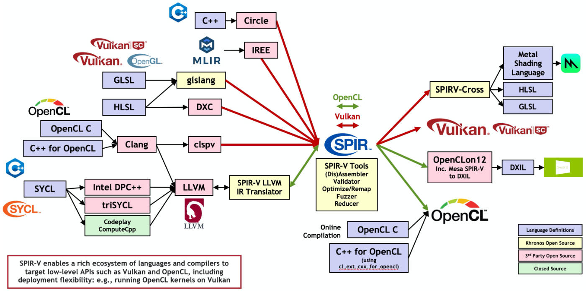

[TOC]

# 1 背景介绍

根据计算效率和用途，着色器分为离线渲染着色器和实时渲染着色器。

离线渲染着色器是在离线渲染中使用的着色器，其可以实现尽可能高的图像质量。实现该类着色器时，不需要什么编程技巧和硬件知识，其中材料属性是完全抽象的概念。这类着色器通常由艺术家开发，从而获得正确合适的 "效果"。由于离线渲染的目的是产生足够逼真且精细的结果，离线渲染着色器需要进行大量的计算，所以处理历险着色器是非常耗时的，同时需要大量的计算资源。大多数情况下，离线渲染需要使用大型计算机集群进行计算。典型的离线渲染着色器语言有RenderMan Shading Language（RSL），Houdini VEX Shading Language（VEX），Gelato Shading Language，Open Shading Language（OSL）等等。

实时渲染着色器是用于实时渲染的着色器，由于显卡等硬件的发展，该类着色器当前应用非常广泛。它们提供了更高级的硬件抽象和更灵活的编程模型，而不是以前的硬编码转换和着色器方程的范式。这使得程序员能够更好地控制着色器内部的计算过程和呈现方式，并以较低的开销实现更丰富的内容。该类着色器是本项目关注的重点。

实时渲染着色器是一组程序指令，它们在给定的可编程GPU流水线的特定步骤中执行，可以是光栅化流水线、通用计算、光线追踪等。


现阶段的着色器可以用来转换顶点、在基于光栅的渲染中给像素着色、在射线追踪中处理复杂的计算、训练机器学习模型、执行通用计算等等。着色器在单指令多数据（SIMD）体系结构上执行。在这种体系结构中，计算单元在大量的数据上执行相同的指令。不同的硬件供应商，设计了不同的单指令多数据体系结构。例如，在AMD硬件上，一个内核执行32或64个调度线程，这些线程被称为波阵面或线程组。这些线程在一个小型处理器上执行时，该处理器处理存储在组的本地缓存或GPU内存中的标量、向量数据。

实时渲染着色器的发展历程中，涌现出一批优秀且富有特色的着色器语言，但是仅有少数得以延续和发展，并广为使用。下表为现阶段常见的实时渲染着色器语言、其对应的图形API和其可实现的Transpiling。

| 缩写 | 着色器语言                  | 官方图形API     | Transpiling                             |
| ---- | --------------------------- | --------------- | --------------------------------------- |
| HLSL | High Level Shading Language | DirectX         | `dxc` 与 `glslang` 均支持 HLSL → SPIR-V |
| GLSL | OpenGL Shading Language     | Vulkan / OpenGL | GLSL → SPIR-V → HLSL                    |
| MSL  | Metal Shading Language      | Metal           | SPIR-V Cross 支持 SPIR-V → MSL          |
| WGSL | WebGPU Shading Language     | WebGPU          | `naga` 或 `tint` → SPIR-V               |

除以上的着色器语言之外，还有一些平台特定的语言，例如索尼的PlayStation Shading Language （PSL）、应用于早期Unity 3D的C for Graphics （Cg）等等。使用哪一种语言取决于的应用的目标平台和API。

由于有太多的供应商和API，各类着色器语言在设计上是分散的，但每一种着色语言都与C语言非常相似，使用者可以很容易地在它们之间切换。根据语言的不同，着色器语言可能有一个API特定的中介表示（IR），每个硬件供应商（AMD、NVIDIA、Intel、Qualcomm等）在驱动程序级别上将该IR转换为他们自己的机器代码。现阶段常见的IR如下表所示。

| IR缩写    | 描述                                          | 官方图形API     |
| --------- | --------------------------------------------- | --------------- |
| DXIL      | DirectX Intermediate Language                 | DirectX 12      |
| DXBC      | DirectX Bytecode                              | DirectX 11 / 12 |
| SPIR-V    | Standard Portable Intermediate Representation | Vulkan / OpenGL |
| RDNA2 ISA | AMD 6000 Series Instruction Set Architecture  | N/A             |
| PTX       | NVIDIA Parallel Thread Execution              | N/A             |

本项目采用SPRI-V作为IR，因为其存在完整易用的工具链、优质的文档和活跃的社区。

SPIR-V正在催化用于表达并行计算和基于GPU的图形的着色器和内核语言编译器的生态系统中的一场革命。SPIR-V使高级语言前端能够以标准化的中间形式发出程序，以便被Vulkan、OpenGL或OpenCL驱动程序所吸收。SPIR-V消除了设备驱动程序中对高级语言前端编译器的需求，大大降低了驱动程序的复杂性，使广泛的语言和框架前端能够在不同的硬件架构上运行，并鼓励一个充满活力的开源分析、移植、调试和优化工具的生态系统。对于开发者来说，使用SPIR-V意味着内核源代码不再需要直接开源，内核加载时间可以加快，而且开发者可以选择使用通用的语言前端编译器，提高内核的可靠性和跨多个硬件实现的可移植性。下图可以展示SPRI-V在着色器世界中的充当的角色和发挥的功能。



SPRI-V项目使得着色器世界中的各类语言可以实现相互转化、交叉编译等等，同时将着色器编译的前后端解耦，有助于构建更加灵活方便的开发环境。

# 2 设计思路


本项目所设计的着色器语言编译器所读入的着色器文件后缀为`.sl`。

整个项目可见于仓库：xxx

# 3 词法设计

下表为本项目词法设计模块的Token对照表。

| token_str  | token_sym |
| ---------- | --------- |
| 标识符     | IDENFR    |
| int        | INTTK     |
| float      | FLTTK     |
| array      | ARRTK     |
| void       | VOIDTK    |
| main       | MAINTK    |
| if         | IFTK      |
| else       | ELSETK    |
| while      | WHILETK   |
| return     | RETURNTK  |
| +          | PLUS      |
| -          | MINU      |
| *          | MULT      |
| /          | DIV       |
| <          | LSS       |
| <=         | LEQ       |
| >          | GRE       |
| >=         | GEQ       |
| ==         | EQL       |
| !=         | NEQ       |
| =          | ASSIGN    |
| ;          | SEMICN    |
| ,          | COMMA     |
| (          | LPARENT   |
| )          | RPARENT   |
| [          | LBRACK    |
| ]          | RBRACK    |
| {          | LBRACE    |
| }          | RBRACE    |
| 无符号整数 | INTCON    |
| 无符号小数 | FLTCON    |
| in         | INTK      |
| out        | OUTTK     |
| break      | BRKTK     |
| &&         | ANDTK     |
| \|\|       | ORTK      |


# 4 语法设计

本章介绍本项目语法设计模块的完整语法设计。

## 4.1 类型标识符

```
<类型标识符> ::= int | float | array'['<无符号整数>']' | array'['<无符号整数>']''['<无符号整数>']'

<字母> ::= _ | a | ... | z | A | ... | Z

<数字> ::= 0 | 1 | ... | 9

<无符号整数> ::= <数字> {<数字>}

<整数> ::= [ + | - ] <无符号整数>

<小数> ::= [ + | - ] <无符号小数>

<无符号小数> ::= <无符号整数>'.'<无符号整数>

<加法运算符> ::= + | -

<乘法运算符> ::= * | /

<关系运算符> ::= < | <= | > | >= | != | ==

<标识符> ::= <字母> {<字母>|<数字>}
```

## 4.2 表达式

```
<表达式> ::= [ + | - ]<项>{<加法运算符><项>}

<项> ::= <因子>{<乘法运算符><因子>}

<因子> ::= <标识符> | <标识符>'['<表达式>']' | <标识符>'['<表达式']''['<表达式']' | '('<表达式>')' | <整数> | <小数> | <有返回值函数调用语句>
```

## 4.3 变量定义

```
<常量> ::= <整数> | <小数>

<输入输出说明> ::= <输入输出定义>; {<输入输出定义>;}

<输入输出定义> ::= in <类型标识符> <标识符> | out <类型标识符> <标识符>

<变量说明> ::= <变量定义>; {<变量定义>;}

<变量定义> ::= <变量定义无初始化> | <变量定义及初始化>

<变量定义无初始化> ::= <类型标识符> <标识符>{, <标识符>}

<变量定义及初始化> ::= <类型标识符> <标识符> = <常量> | <类型标识符> <标识符> = '{' <常量> {, <常量>} '}' | <类型标识符> <标识符> = '{''{'<常量>{, <常量>}'}'{, '{'<常量>{, <常量>}'}'}'}'
```

## 4.4 语句

```
<语句> ::= <循环语句> | <条件语句> | <赋值语句>; | <有返回值函数调用语句>; | <无返回值函数调用语句>; | <空>; | <返回语句>; | '{'<语句列>'}' | break;

<条件运算符> ::= && | ||

<条件> ::= <条件项>{<条件运算符><条件项>}

<条件项> ::= <表示式><关系运算符><表达式> | '('<条件>')'

<循环语句> ::= while '('<条件>')' <语句>

<条件语句> ::= if  '('<条件>')' <语句> [else <语句>]

<赋值语句> ::= <标识符> = <表达式> | <标识符> = '{'<表达式>{, <表达式>}'}' | <标识符> = '{''{'<表达式>{, <表达式>}'}'{, '{'<表达式>{, <表达式>}'}'}'}' | <标识符>'['<表达式>']' = <表达式> | <标识符>'['<表达式>']''['<表达式>']' = <表达式> 

<值参数表> ::= <表达式>{, <表达式>} | <空>

<有返回值函数调用语句> ::= <标识符>'('<值参数表>')'

<无返回值函数调用语句> ::= <标识符>'('<值参数表>')'

<返回语句> ::= return [<表达式>]
```

## 4.5 函数与程序

```

<声明头部> ::= <类型标识符> <标识符>

<参数表> ::= <类型标识符> <标识符>{, <类型标识符> <标识符>} | <空>

<复合语句> ::=[<变量说明>] <语句列>

<有返回值函数定义> ::= <声明头部>'('<参数表>')''{'<复合语句>'}'

<无返回值函数定义> ::= void <标识符> '('<参数表>')''{'<复合语句>'}'

<主函数> ::= void main '('')' '{'<复合语句>'}'

<语句列> ::= {<语句>}

<程序> ::= [<输入输出说明>] [<变量说明>] {<有返回值函数定义>|无返回值函数定义} <主函数>
```


# 5 语义分析


# 6 目标代码生成


# 7 实现与测试

## 7.1 实现

本项目完全使用Python实现，具有将`.sl`着色器文件编译为spri-v代码`.spvasm`文件的功能。编译器实现的内容包括xxx、xxx和xxx。

下面给出一些接口：


## 7.2 测试

本项目编译器的测试模块使用c++实现，并且使用了SPRI-V社区中的工具。

测试过程如下：

1. 编写顶点着色器`main.vert`和片段着色器`main.frag`
2. 使用本项目编译器将顶点着色器`main.vert`和片段着色器`main.frag`编译为对应的SPRI-V代码`main.vert.spvasm`和片段着色器`main.frag.spvasm`
3. 使用开源项目spriv-cross中的`spriv-as.exe`将`.spvasm`转化为对应的二进制文件`.spv`
4. 运行`VKexample_mingw.exe`，得到顶点着色器和片段着色器的运行效果。

着色器代码并不能独自运行，而是需要依靠图形学API的调用。Vulkan是由Khronos Group提出的新一代图形API，可实现渲染管线的高度定制，其要求读入的着色器代码必须是`.spv`二进制格式。VKexample_mingw.exe由项目vulkan-example编译而来，该项目主要使用Vulkan图形API实现了创建窗口、读入顶点着色器spv代码和片段着色器spv代码，链接着色器代码，对着色器内置变量进行赋值、调用API运行着色器代码等步骤，使得着色器所实现的效果可以显现出来。

Vulan的环境配置复杂，导致想要尝试本项目的开发者需要花费大量的时间配置环境。本项目将vulkan-example项目编译为`.exe`可执行程序，方便开发者直接使用测试。


# 8 对比分析（可略）


# 9 总结与局限性


